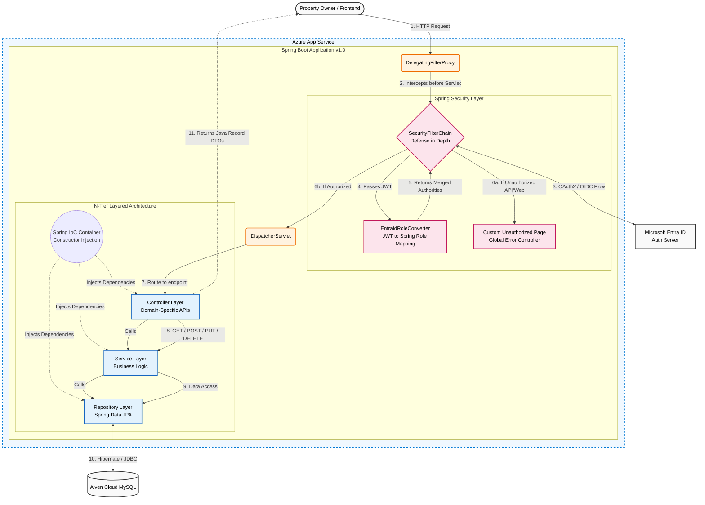
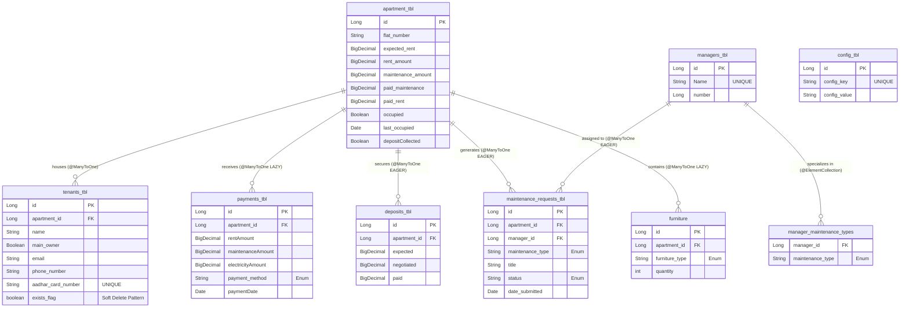

# Property Management Portal (MVP v1.0)

A secure, full-stack enterprise web application engineered specifically for **Shri Shyam Kaleshwar Residency**. Designed to digitize and streamline their property management operations, this system provides a centralized dashboard for the property owner to track financial records, manage tenant lifecycles, and oversee maintenance requests.

The application is currently in active production testing (v1.0), serving as a live MVP to validate core business workflows and data architecture in a real-world environment.

**Note:** As of `v1.0`, the system is heavily secured and restricted strictly to the `OWNER` role. Tenant-facing portals are planned for future iterations.

## Tech Stack & Architecture
* **Backend:** Java 17, Spring Boot, Spring Security, Spring Data JPA, Hibernate
* **Frontend:** HTML5, CSS3, JavaScript, Thymeleaf (Server-side rendering)
* **Database:** Managed Aiven Cloud MySQL (Strict SSL)
* **Identity & Access Management:** Microsoft Entra ID (OAuth2 / OIDC)
* **Hosting:** Azure App Service (Linux, Java SE)

--------------------------------------------

## Architecture Diagram & Security Flow

---------------------------------

-------------------------------------

## N-Tier Layered Architecture & Domain Modules

The application enforces a strict separation of concerns by combining an **N-Tier (Layered) Architecture** with vertical domain slicing. All dependencies are managed and injected via Spring's **Inversion of Control (IoC) container** using Constructor Injection, ensuring the codebase remains modular, testable, and loosely coupled.

### How the Data Flows (Horizontal Layers)
Every incoming HTTP request traverses three distinct horizontal layers before returning a response:
1. **Controller Layer (Presentation):** REST API endpoints intercept GET, POST, PUT, and DELETE requests. This layer validates incoming parameters and maps the final outbound data into lightweight **Java Records (DTOs)**, ensuring internal database entities are never exposed directly to the frontend.
2. **Service Layer (Business Logic):** This layer acts as the brain of the application. It handles complex business rules, calculations, and enforces `@Transactional` boundaries so that any failing database operations are safely rolled back.
3. **Repository Layer (Data Access):** Interfaces extending Spring Data JPA manage all direct database interactions. This layer translates Java method calls into optimized SQL queries via Hibernate, communicating securely with the Aiven Cloud database.

### Core Business Domains (Vertical Slices)
To maintain a scalable enterprise structure, the N-Tier pattern is applied vertically across **8 distinct business domains**. Each of these modules operates independently with its own dedicated Entity, Repository, Service, and Controller:

1. **Apartments:** Manages physical property data, unit availability, and expected vs. actual rent scaling.
2. **Tenants:** Handles occupant lifecycle and leverages **soft-delete** mechanisms (`exists_flag`) to **retain historical tenant data.**
3. **Furniture:** Tracks inventory and asset allocation tied to specific units.
4. **Payments:** Records financial transactions, logging rent, maintenance, and utility breakdowns securely.
5. **Deposits:** Manages the negotiation, collection, and tracking of security deposits.
6. **Maintenance Requests:** Handles the ticketing system, tracking issue statuses, timestamps, and priority levels.
7. **Managers:** Maps specific maintenance personnel to the specialized request types they are qualified to handle.
8. **Configuration:** A dynamic settings table for storing environment variables and global application states.

-------------------------

## Security & Authentication Architecture (Defense-in-Depth)

This application implements a hardened, zero-trust security posture leveraging **Spring Security 6** and **OAuth2 / OpenID Connect (OIDC)**. The authentication and authorization pipelines are strictly decoupled, utilizing Microsoft Entra ID as the primary Identity Provider (IdP).

### 1. The OAuth2 / OIDC Handshake
* **Authentication Flow:** Unauthenticated traffic hitting the `DelegatingFilterProxy` is intercepted and routed through the `OAuth2AuthorizationRequestRedirectFilter`. Users are redirected to the Microsoft Entra ID authorization endpoint.
* **Token Resolution:** Upon successful authentication, the application exchanges the authorization code for an ID Token and Access Token (JWT) via the OIDC back-channel.

### 2. JWT Interception & Custom Role Translation (RBAC)
Out-of-the-box Spring Security prefixes roles with `SCOPE_` based on standard OAuth2 claims, which is insufficient for enterprise Role-Based Access Control.
* Engineered a custom **`EntraIdRoleConverter`** (implementing `Converter<Jwt, AbstractAuthenticationToken>`).
* This component intercepts the incoming Entra ID JWT, extracts the custom `roles` claim natively defined in the Azure App Registration, and dynamically maps them into standard Spring **`GrantedAuthority`** objects (e.g., mapping to `ROLE_OWNER`).

### 3. Granular Route Protection (`SecurityFilterChain`)
Authorization is enforced at the Servlet Filter level before requests ever reach the `DispatcherServlet`.
* **API Lockdown:** All internal data endpoints (e.g., `/apartments/**`, `/tenants/**`) explicitly require `hasRole('OWNER')`.
* **Static Asset Protection:** The frontend directories (e.g., `/OWNER_PAGES/**`) are secured behind the same filter chain, preventing unauthorized users from even downloading the HTML/JS payloads of the dashboard.

### 4. Custom Exception Handling & Routing
To prevent the notorious "infinite redirect loop" bug common in misconfigured OAuth2 applications, the security chain includes custom exception routing:
* **`AccessDeniedHandler`:** Catches authenticated users attempting to access elevated routes (403 Forbidden) and gracefully redirects them to a dedicated, visually consistent `/access-denied` endpoint handled by the `GlobalErrorController`.
* **Unmapped Roots:** Implemented a root level redirect (`/`) to automatically funnel successfully authenticated `OWNER` traffic directly into the secure dashboard.