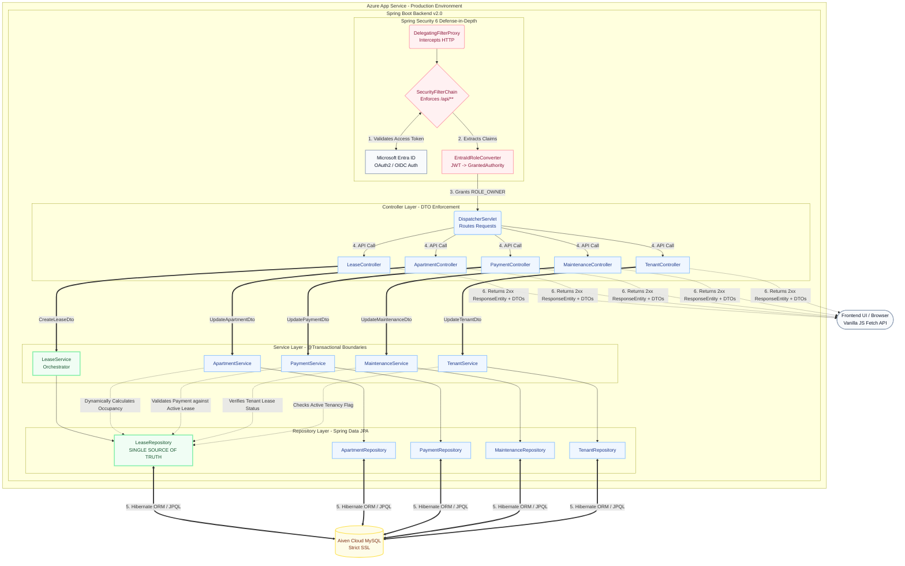
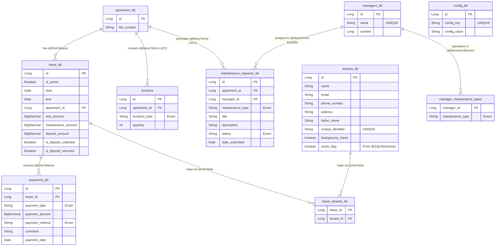

# Property Management Portal (Backend v2.0)

A secure, enterprise-grade web application engineered specifically for **Shri Shyam Kaleshwar Residency**. Designed to digitize and streamline property management operations, this system provides a centralized platform to track financial ledgers, manage tenant lifecycles, and oversee maintenance operations.

The application has recently undergone a major infrastructure migration to **Backend v2.0**, transitioning from a tightly coupled monolith to a highly normalized, relational architecture where the **Lease contract acts as the Single Source of Truth (SSOT)**.

**Note:** As of `v2.0`, the backend API contracts and database schemas are finalized. The frontend UI is currently being refactored to consume these standardized REST endpoints. The system remains heavily secured and restricted strictly to the `OWNER` role via Microsoft Entra ID.

## Tech Stack & Architecture
* **Backend:** Java 17, Spring Boot, Spring Security, Spring Data JPA, Hibernate
* **Frontend:** HTML5, CSS3, JavaScript (Vanilla fetch API integration), Tailwind CSS
* **Database:** Managed Aiven Cloud MySQL (Strict SSL)
* **Identity & Access Management:** Microsoft Entra ID (OAuth2 / OIDC)
* **Hosting:** Azure App Service (Linux, Java SE)

--------------------------------------------

## Table of Contents
1. [Architecture Diagram & Security Flow](#architecture-diagram--security-flow)
2. [Database Schema Diagram](#database-schema-diagram)
3. [N-Tier Layered Architecture & Domain Modules](#n-tier-layered-architecture--domain-modules)
4. [Security & Authentication Architecture (Defense-in-Depth)](#security--authentication-architecture-defense-in-depth)
5. [v1.0 Constraints & v2.0 Solutions](#v10-constraints--v20-solutions)
6. [Key Architectural Decisions](#key-architectural-decisions)

---

--------------------------------------------

## Architecture Diagram & Security Flow

---------------------------------

## Database Schema Diagram

-------------------------------------

## N-Tier Layered Architecture & Domain Modules

The application enforces a strict separation of concerns by combining an **N-Tier (Layered) Architecture** with vertical domain slicing. All dependencies are managed and injected via Spring's **Inversion of Control (IoC) container** using Constructor Injection, ensuring the codebase remains modular, testable, and loosely coupled.

### How the Data Flows (Horizontal Layers)
Every incoming HTTP request traverses three distinct horizontal layers before returning a response:
1. **Controller Layer (Presentation):** REST API endpoints intercept GET, POST, PUT, and DELETE requests. This layer validates incoming parameters and maps the final outbound data into lightweight **Java Records (DTOs)**, ensuring internal database entities are never exposed directly to the frontend.
2. **Service Layer (Business Logic):** This layer acts as the brain of the application. It handles complex business rules, calculations, and enforces `@Transactional` boundaries so that any failing database operations are safely rolled back.
3. **Repository Layer (Data Access):** Interfaces extending Spring Data JPA manage all direct database interactions. This layer translates Java method calls into optimized SQL queries via Hibernate, communicating securely with the Aiven Cloud database.

### Core Business Domains (Vertical Slices)
To maintain a scalable enterprise structure, the N-Tier pattern is applied vertically across **8 distinct business domains**. With the v2.0 migration, the legacy `Deposit` domain was eradicated, and dependencies were fundamentally rewired. Each of these modules operates independently with its own dedicated Entity, Repository, Service, and Controller:

1. **Lease (The Core Domain):** The Single Source of Truth. Binds tenants to physical properties, dictates expected financial parameters (rent, maintenance, deposits), and governs the lifecycle of the occupancy.
2. **Apartments:** Manages physical property identifiers. State data (like current occupancy or last occupied date) is no longer hardcoded; it is dynamically queried from the Lease domain to prevent data desynchronization.
3. **Tenants:** Immutable occupant profiles. Utilizes soft-delete mechanisms (`exists_flag`) to preserve historical financial integrity and relationship mapping long after a tenant vacates.
4. **Payments:** The financial ledger. Strictly bound to the `Lease` entity rather than physical units, ensuring complex financial histories survive tenant turnover and property modifications.
5. **Maintenance Requests:** Handles the facility ticketing system. Requests are rigorously validated against active lease contracts to prevent orphaned tickets from former tenants.
6. **Managers:** Maps specific maintenance personnel to the specialized request types (e.g., PLUMBING, ELECTRICAL) they are qualified to handle.
7. **Furniture:** Tracks physical inventory and asset allocation tied to specific units.
8. **Configuration:** A dynamic settings table for storing environment variables and global application states.

----------------------------------------

## Security & Authentication Architecture (Defense-in-Depth)

This application implements a hardened, zero-trust security posture leveraging **Spring Security 6** and **OAuth2 / OpenID Connect (OIDC)**. The authentication and authorization pipelines are strictly decoupled, utilizing Microsoft Entra ID as the primary Identity Provider (IdP).

### 1. The OAuth2 / OIDC Handshake
* **Authentication Flow:** Unauthenticated traffic hitting the `DelegatingFilterProxy` is intercepted and routed through the `OAuth2AuthorizationRequestRedirectFilter`. Users are redirected to the Microsoft Entra ID authorization endpoint.
* **Token Resolution:** Upon successful authentication, the application exchanges the authorization code for an ID Token and Access Token (JWT) via the OIDC back-channel.

### 2. JWT Interception & Custom Role Translation (RBAC)
Out-of-the-box Spring Security prefixes roles with `SCOPE_` based on standard OAuth2 claims, which is insufficient for enterprise Role-Based Access Control.
* Engineered a custom **`EntraIdRoleConverter`** (implementing `Converter<Jwt, AbstractAuthenticationToken>`).
* This component intercepts the incoming Entra ID JWT, extracts the custom `roles` claim natively defined in the Azure App Registration, and dynamically maps them into standard Spring **`GrantedAuthority`** objects (e.g., mapping to `ROLE_OWNER`).

### 3. Granular Route Protection (`SecurityFilterChain`)
Authorization is enforced at the Servlet Filter level before requests ever reach the `DispatcherServlet`.
* **API Lockdown:** All internal data endpoints (e.g., `/apartments/**`, `/tenants/**`) explicitly require `hasRole('OWNER')`.
* **Static Asset Protection:** The frontend directories (e.g., `/OWNER_PAGES/**`) are secured behind the same filter chain, preventing unauthorized users from even downloading the HTML/JS payloads of the dashboard.

### 4. Custom Exception Handling & Routing
To prevent the notorious "infinite redirect loop" bug common in misconfigured OAuth2 applications, the security chain includes custom exception routing:
* **`AccessDeniedHandler`:** Catches authenticated users attempting to access elevated routes (403 Forbidden) and gracefully redirects them to a dedicated, visually consistent `/access-denied` endpoint handled by the `GlobalErrorController`.
* **Unmapped Roots:** Implemented a root level redirect (`/`) to automatically funnel successfully authenticated `OWNER` traffic directly into the secure dashboard.

----------------------------------------

## v1.0 Constraints & v2.0 Solutions

The initial v1.0 MVP worked well for validating core business workflows, but testing the database design exposed several limitations. The v2.0 update focuses on moving away from an apartment-centric model and restructuring the system around leases to better reflect real-world relationships.

### 1. Domain Decoupling & Lease-Based Structure

**v1.0 Constraint:**  
Tenants and payments were directly linked to the apartment. This meant there was no clear contract layer, and data could be overwritten or lost when a tenant moved out and a new one moved in.

**v2.0 Solution:**  
Tenants and payments are no longer tied directly to apartments. Instead, they are connected through the Lease entity. This ensures that each tenant’s history and payments are associated with a specific lease, not just the apartment itself.

### 2. Removing the Separate Deposit Domain

**v1.0 Constraint:**  
Deposits were handled in a separate table, which was not tightly connected to lease data. This required manual coordination to keep deposit status in sync with other records.

**v2.0 Solution:**  
Deposit-related fields are now part of the Lease entity. This keeps all financial details related to a lease in one place and reduces the chances of inconsistencies.

### 3. Handling Financial History Correctly

**v1.0 Constraint:**  
Values like `expected_rent` were stored on the apartment. If rent changed over time, older payment records could appear incorrect because they were being compared to the current rent instead of the rent at the time.

**v2.0 Solution:**  
Each lease stores its own financial terms (rent, maintenance, deposit). When rent changes, a new lease is created. This keeps historical data accurate and avoids confusion when reviewing past payments.

### 4. Removing Redundant State Fields

**v1.0 Constraint:**  
Fields like `occupied` and `last_occupied` were stored directly on the apartment. These had to be updated manually and could easily become inconsistent if something failed during an update.

**v2.0 Solution:**  
These fields were removed. Occupancy is now determined by checking whether there is an active lease for the apartment. This avoids duplicated state and keeps the system consistent.

----
## Key Architectural Decisions

These design choices form the backbone of the application, ensuring it is secure, maintainable, and capable of handling real-world property management scenarios without data corruption.

### 1. The "Lease" as the Source of Truth
**The Decision:** Instead of connecting tenants and their payments directly to a physical apartment, everything is tied to a `Lease` contract.

**The Significance:** Rent prices change, and tenants move from one unit to another. If a payment is tied directly to a physical room, changing the rent price tomorrow would mathematically corrupt the accounting history from yesterday. By anchoring everything to a Lease, the system locks in the specific financial terms of that exact timeframe, preserving a perfectly accurate historical ledger.

### 2. Soft Deletions for Financial Auditing
**The Decision:** Implementing an `exists_flag` on the Tenant domain instead of allowing hard deletions (SQL `DELETE`).

**The Significance:** In real-world property management, you cannot simply erase a tenant from the database when they move out; their payment history is required for tax and auditing purposes. Soft-deleting allows the application to hide old tenants from active dashboard views while permanently preserving their financial footprint in the database.

### 3. Strict DTO (Data Transfer Object) Boundaries
**The Decision:** Refusing to send raw database entities (Hibernate models) to the frontend, instead mapping them to custom Java `Record` classes.

**The Significance:** Sending raw database tables to the frontend is a massive security risk, often exposing internal IDs or triggering infinite JSON recursion when tables are linked to one another. DTOs act as a security checkpoint, ensuring the frontend only receives the exact, sanitized data it needs to render the page.

### 4. Dynamic State Calculation vs. Static Columns
**The Decision:** Removing static status columns like `is_occupied` or `total_rent_paid` from the database tables and calculating them on the fly.

**The Significance:** Hardcoded status columns easily fall out of sync. If a tenant moves out and the system updates the lease but a network error prevents it from updating the `is_occupied` column, the database is now corrupted. By calculating occupancy on the fly (e.g., asking the database "does an active lease exist for this room right now?"), the system guarantees 100% data accuracy at all times.

### 5. Delegating Heavy Lifting to the Database
**The Decision:** Using custom JPQL queries and database-level filtering instead of pulling lists into Java and filtering them with Streams.

**The Significance:** As the application scales, pulling thousands of payment or lease records into the Spring Boot application just to find the "active" ones would cause massive memory spikes. By writing precise SQL/JPQL queries, the filtering burden is shifted to the Aiven MySQL database, which is specifically optimized for sorting data. This keeps the backend server lightweight and fast.

### 6. Automated Self-Maintenance (Cron Jobs)
**The Decision:** Implementing a nightly scheduled background task (Cron Job) to automatically scan for and deactivate expired leases.

**The Significance:** Relying on property managers to manually click "deactivate" when a lease ends guarantees human error, which would eventually result in vacant apartments showing as "occupied" on the dashboard. Automating this lifecycle ensures the system's operational data remains 100% accurate in real-time without requiring constant human intervention.

### 7. Defensive Deletion Boundaries
**The Decision:** Implementing application-level constraint checks before allowing the deletion of core entities (e.g., explicitly blocking the deletion of an `Apartment` if an active `Lease` is currently tied to it).

**The Significance:** In enterprise software, users make mistakes. If an admin accidentally clicks "Delete" on an apartment that currently houses active tenants, it could orphan the lease and payment records, crashing the application. By putting a defensive shield in the Service layer, the system safely catches the error and alerts the user to terminate the lease first, protecting the database's structural integrity.